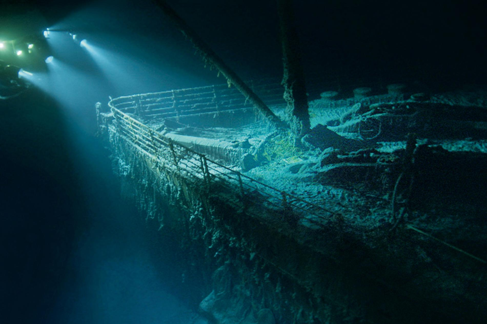

# Titanic Machine Learning from Disaster

This notebook is detailed walkthrough of all the steps I took to make my first Kaggle submission. The Challenges I faced in the process are not unique to you or someone who is just starting with Kaggle. Keeping in mind I have provided a detailed description of steps along with references and links. Taking reference from various internet blogs and videos, I finally put my code to work, I hope you find it useful and a kickstart for your ML journey. As you explore through more and more projects and get your hands dirty, you will gain more knowlege. The tough part is to get started, and believe me to just take a leap of faith. and its okay if you dont understand the code completely, with repetions the things form a clear picture of concepts.So lets dive in!

#### Best Model: Random Forest Classifier
#### Best Score on train data: 80.92
#### Score on submission: 74.16

## Contents:

1. Project Skeleton
2. Loading dataset (Downloaded from Kaggle)
3. Exploratory Data Analysis
    -   Exploring Missing Values
    -  Data Interpretation and Visualization
    - Count Plot for Features
    -  Feature Relationships
4. Data Pre-processing and Feature Engineering
    -   Check Feature Data Types
    -  Walk Through Each Feature One by One
    - Re-Check Datasets
5. Modelling
    -  Try Different Models
    - Survival Prediction on Test Data
6. Conclusion

## Data Dictionary (From Kaggle)

Variable	|Definition|	Key
----------|----------|------------
survival	|Survival|	0 = No, 1 = Yes
pclass	|Ticket class|	1 = 1st, 2 = 2nd, 3 = 3rd
sex	|Sex|	
Age	|Age in years	|
sibsp|	# of siblings / spouses aboard the Titanic	
parch	|# of parents / children aboard the Titanic	
ticket|	Ticket number	
fare|	Passenger fare	
cabin|	Cabin number	
embarked|	Port of Embarkation	|C = Cherbourg, Q = Queenstown, S = Southampton

### Contact:
- Email: amritvirsinghx@gmail.com
- Linkedin: https://www.linkedin.com/in/amritvirsinghx/
